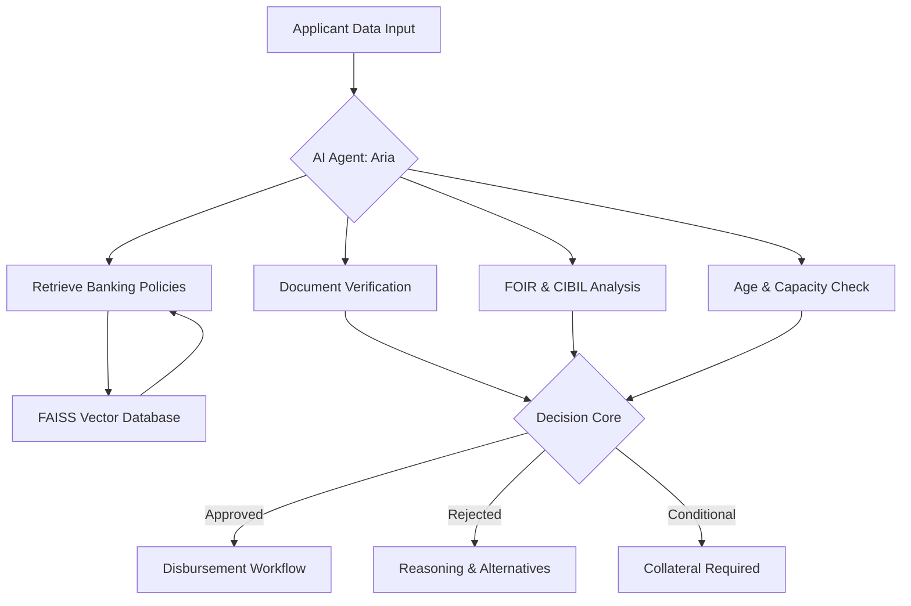

# 🏦 PROJECT REPORT: NexaBank AI Credit Officer (Aria)

**Date**: April 18, 2026  
**Author**: [Your Name / Candidate Name]  
**Project Role**: AI Developer / Full-stack Developer Assessment

---

## 1. Executive Summary
The **NexaBank AI Credit Officer** project is a comprehensive loan processing ecosystem designed to automate and augment traditional banking workflows. By leveraging **Agentic AI** and **Retrieval-Augmented Generation (RAG)**, the system reduces manual assessment time from days to seconds while maintaining strict adherence to banking policies. The project features a premium "Glassmorphism" UI, a high-performance FastAPI backend, and a standalone Streamlit dashboard for quick deployment.

---

## 2. Technical Architecture
The system follows a modern decoupled architecture, ensuring scalability and maintainability.

### 🧩 System Design (Workflow)

### 🛠️ Technology Stack
- **Frontend**: React (Vite) with Custom Vanilla CSS Design System.
- **Backend**: FastAPI (Python) for asynchronous throughput.
- **AI/ML Logic**: 
  - **RAG Engine**: FAISS (Facebook AI Similarity Search) for semantic policy retrieval.
  - **Decision Chain**: Agentic multi-step validation logic.
- **Standalone Dashboard**: Streamlit for rapid presentation and cloud hosting.

---

## 3. Core Implementation Details

### ⚡ The AI Agent: "Aria"
Aria is not just a form processor; she is an **Agentic AI entity** that:
1.  **Synthesizes** data from multiple sources (Income, Debt, CIBIL).
2.  **Validates** applicant ages (Ensuring 18-70 years compliance).
3.  **Cross-references** loan types with specific bank multipliers (e.g., Home Loans allow for 7x annual income whereas Personal Loans allow 5x).

### 🔍 RAG Integration
Traditional systems hardcode interest rates. Aria uses **RAG**:
- **Knowledge Base**: Policy documents are encoded into vectors.
- **Semantic Search**: When a user selects "Home Loan," the agent retrieves the exact interest rates and document requirements dynamically from the vector store.

---

## 4. UI/UX Philosophy
The project prioritizes a **"Premium"** feel to instill trust in the banking environment:
- **Design System**: A custom "Glassmorphism" theme using `backdrop-filter` and CSS variables.
- **Animations**: Micro-interactions and status-badge animations reinforce the "Smart" nature of the application.
- **Responsive Layout**: Designed to work seamlessly on desktops and tablets for field agents.

---

## 5. Development Journey (Start to Finish)

### Phase 1: Requirement Analysis & Backend Core
- Defined the "AI Agent Bank" objective.
- Built the FastAPI framework and implemented the RAG engine with FAISS.
- Developed the core decision logic (FOIR, CIBIL scoring).

### Phase 2: High-Fidelity Frontend Development
- Established the CSS Design System (`index.css`).
- Built the React components (`LoanForm`, `AgentDashboard`).
- Integrated Axios for real-time E2E connectivity.

### Phase 3: Brand Identity & Polish
- Generated the **NexaBank Headquarters** hero background.
- Named the AI Agent **Aria** and refined its identity.
- Added age limit constraints and robust error handling.

### Phase 4: Expansion & Documentation
- Developed the standalone **Streamlit Dashboard** (`app_streamlit.py`) for cloud-readiness.
- Authored the **Detailed Project Report** and **GitHub Guide**.

---

## 6. Future Roadmap
- **OCR Integration**: Automate Aadhaar/PAN data extraction from uploaded images.
- **Blockchain Disbursement**: Instant, immutable fund credit using Smart Contracts.
- **Multi-Agent Collaboration**: Introducing a separate "Verification Agent" for fraud detection.

---

## 7. Conclusion
This project demonstrates a production-ready approach to AI-integrated banking. By combining a professional frontend with an agentic backend, it solves real-world efficiency problems while providing a superior user experience.

---
**[Your GitHub Link]** | **[Live Demo Link]**
